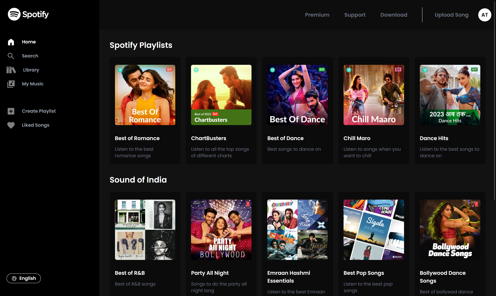

# Spotify Clone



A Spotify clone built using the MERN stack (MongoDB, Express.js, React.js, Node.js), with the following features:

- User Authentication:
  - Signup and login using Passport.js and JWT.

- Song Management:

  - Upload songs to the platform.
  - Listen to songs with play/pause functionality.
  - Search for songs by title.

- Playlist Management:

  - Create and manage playlists.
  - Add songs to playlists.
  - View individual playlists.

  
## Deployment

- **Frontend**: The frontend of this Spotify clone is deployed on Vercel. You can access it using the following link: [Spotify Clone Frontend](https://spotifyclone-frontend.vercel.app/login).

- **Backend**: The backend of this Spotify clone is deployed on Render. You can access it using the following link: [Spotify Clone Backend](https://spotifyclone-f2ek.onrender.com).

## Table of Contents

- [Getting Started](#getting-started)
  - [Prerequisites](#prerequisites)
  - [Installation](#installation)
- [Usage](#usage)
  - [Authentication](#authentication)
  - [Uploading Songs](#uploading-songs)
  - [Listening to Songs](#listening-to-songs)
  - [Creating Playlists](#creating-playlists)
  - [Adding Songs to Playlists](#adding-songs-to-playlists)
  - [Viewing Playlists](#viewing-playlists)
- [Technologies Used](#technologies-used)
- [Contributing](#contributing)

## Getting Started

### Prerequisites

Before you begin, ensure you have met the following requirements:

- Node.js installed on your local machine
- MongoDB installed and running locally or hosted remotely

### Installation

1. Clone the repository:

   ```bash
   https://github.com/dev-akhilesh/SpotifyCLone.git
   cd spotify-clone
   ```

2. Install server dependencies:

   ```bash
   cd backend
   npm install
   ```

3. Install client dependencies:

   ```bash
   cd frontend
   npm install
   ```

4. Create a `.env` file in the backend directory and set the following environment variables:

   ```env
   MONGO_PASSWORD=your-mongodb-connection-string
   SECRET_KEY_PASSPORT=your-secret-key
   ```

5. Start the server:

   ```bash
   cd ../backend
   npm server
   ```

6. Start the client:

   ```bash
   cd ../frontend
   npm start
   ```

## Usage

### Authentication

- Sign up or log in to access the full functionality of the Spotify clone.

### Uploading Songs

- Upload your favorite songs to the platform. Supported formats include MP3 and WAV.

### Listening to Songs

- Play and pause songs as you listen to your uploaded tracks.

### Creating Playlists

- Create new playlists to organize your music collection.

### Adding Songs to Playlists

- Add songs to your playlists by selecting the song and the target playlist.

### Viewing Playlists

- View your playlists and listen to the songs within each playlist individually.

## Technologies Used

- **MongoDB**: Database for storing songs, users, and playlists.
- **Express.js**: Backend framework for handling API requests.
- **React**: Frontend library for building the user interface.
- **Node.js**: Runtime environment for the server.
- **Passport.js**: Authentication middleware.
- **JSON Web Tokens (JWT)**: Secure authentication.
- **bcrypt**: Library for hashing passwords.
- **Mongoose**: MongoDB object modeling for Node.js.
- **Tailwind CSS**: A utility-first CSS framework for styling the application.
- **React Cookie**: For managing cookies in the React application.
- **React Router DOM**: Routing for single-page applications.
- **Howler**: JavaScript library for audio playback.
- **Cloudinary**: Cloud-based image and video management for uploading and storing media files.
- **Iconify**: A platform-agnostic icon framework for adding icons to the user interface.

## Contributing

Contributions are welcome! If you'd like to contribute to this project, please fork the repository and create a pull request. Please ensure your code follows the project's coding standards.
